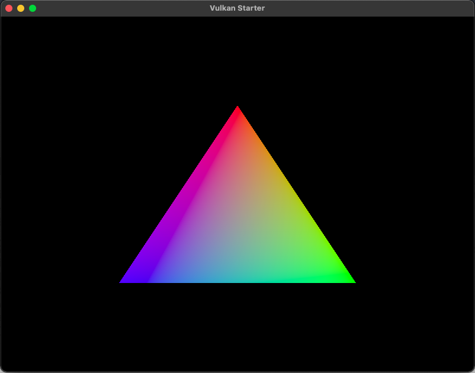

# Vulkan Starter
A basic Vulkan implementation that renders a simple triangle. If you see this, then
please be aware that the code is still a work in progress as I continue to clean up
the code and increase readability.



## Requirements
* [GLFW](https://glfw.org) - Cross-platform windowing
* [Vulkan SDK](https://vulkan.lunarg.com/) - Graphics API
* Your system must also be compatible with Vulkan

### Dependencies
It's assumed that you understand how to compile the GLFW library for your specific platform. If not, then refer to GLFW's documentation. Create a folder called ```Dependencies``` within the root folder and place the GLFW library inside that folder. To know exactly the paths required please take a look the the ```premake5.lua``` file which has all the project configuration settings.

*Important note*: Once the Vulkan SDK is installed on your system, make sure to 
edit the paths to the correct Vulkan SDK directory within the ```premake5.lua``` configuration file and the ```CompileShaders.sh``` file.

## Building

For compiling this example project, [premake](https://premake.github.io/) is used
to generate project files depending on your operating system and development enviroment. Please refer to their [documentation](https://premake.github.io/docs/Building-Premake) regaring generating project files. Premake is reponsible for including the correct header files and linking to the required libraries.

### Shader Compiling
Unlike in OpenGL, shaders cannot be loaded as text directly to Vulkan. Instead,
Vulkan requires shaders to be in the SPIR-V (Standard, Portable Intermediate Representation-V) intermediate language format when loaded. 

This example project already includes precompiled SPIR-V shader files, however, if
you make any changes to the source text shader files then make sure to compile them.
There are a few ways to achieve this however, for simplicity, the Vulkan SDK provides a program called ```glslc``` which converts the shader files at ```Source/Shaders``` from text to SPIR-V and outputs them to the ```Build``` directory which then get loaded at runtime to Vulkan.
